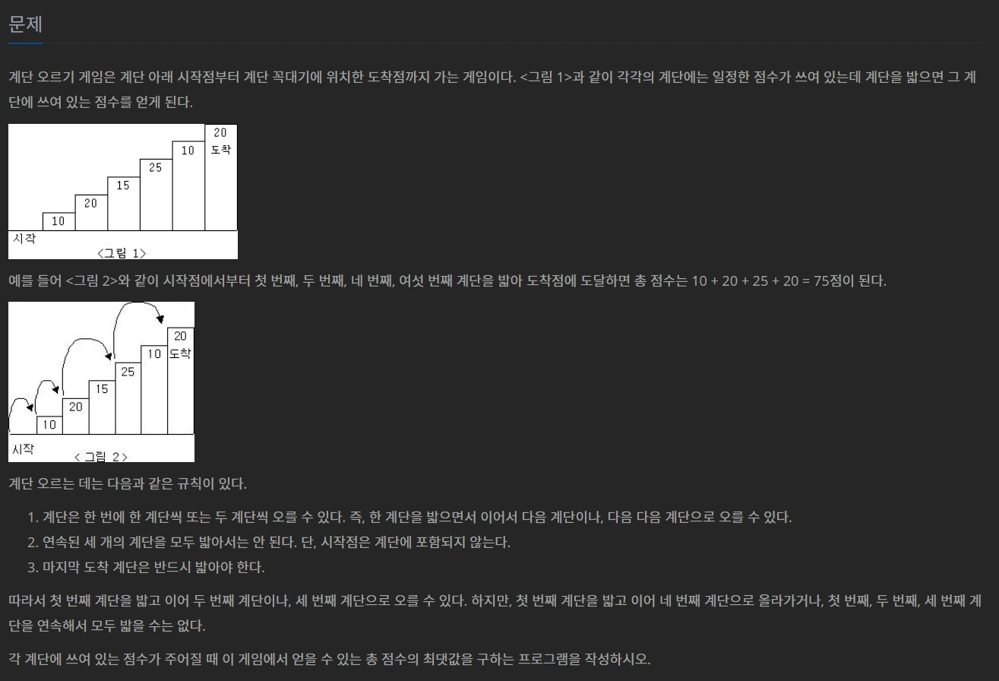

# 백준 2579번 계단 오르기 파이썬

### 문제



### 입력

입력의 첫째 줄에 계단의 개수가 주어진다.

둘째 줄부터 한 줄에 하나씩 제일 아래에 놓인 계단부터 순서대로 각 계단에 쓰여 있는 점수가 주어진다. 계단의 개수는 300이하의 자연수이고, 계단에 쓰여 있는 점수는 10,000이하의 자연수이다.

### 출력

첫째 줄에 계단 오르기 게임에서 얻을 수 있는 총 점수의 최댓값을 출력한다.

### 예제 입력 1

```
6
10
20
15
25
10
20
```

### 예제 출력 1

```
75
```

### 제출 답안

```python
n = int(input())
array = [ int(input()) for _ in range(n)]
d = [0] * 10000

d[0] = array[0]
if n > 3:
    d[1] = array[0] + array[1]
    d[2] = max(array[0] + array[2], array[1] + array[2])
    for i in range(3, n):
        d[i] = max(d[i-2]+array[i],d[i-3]+array[i]+array[i-1])
    print(d[n - 1])
elif n == 1:
    print(d[0])
elif n == 2:
    d[1] = array[0] + array[1]
    print(d[1])
elif n == 3:
    d[1] = array[0] + array[1]
    d[2] = max(array[0] + array[2], array[1] + array[2])
    print(d[2])
```

1. 마지막 계단 기준으로 마지막은 밟아야하니 마지막과 마지막전, 혹은 마지막과 두번째전 이렇게 봐야한다.
   1. 즉 자기가 마지막 계단이라고 생각하면 위의 식처럼 짜면 된다.
2. 그래서 3까지는 계산해주고 나머지는 다이나믹으로 돌리면 된다.
3. 그대신 3까지는 개별적으로 만들어야 인덱스오류가 안난다.