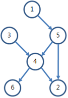
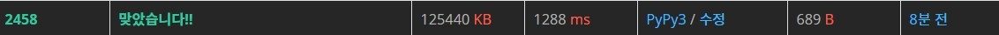

# 백준 2458번 키순서 파이썬

- 플로이드-워셜

### 문제

1번부터 N번까지 번호가 붙여져 있는 학생들에 대하여 두 학생끼리 키를 비교한 결과의 일부가 주어져 있다. 단, N명의 학생들의 키는 모두 다르다고 가정한다. 예를 들어, 6명의 학생들에 대하여 6번만 키를 비교하였고, 그 결과가 다음과 같다고 하자. 

- 1번 학생의 키 < 5번 학생의 키
- 3번 학생의 키 < 4번 학생의 키
- 5번 학생의 키 < 4번 학생의 키
- 4번 학생의 키 < 2번 학생의 키
- 4번 학생의 키 < 6번 학생의 키
- 5번 학생의 키 < 2번 학생의 키

이 비교 결과로부터 모든 학생 중에서 키가 가장 작은 학생부터 자신이 몇 번째인지 알 수 있는 학생들도 있고 그렇지 못한 학생들도 있다는 사실을 아래처럼 그림을 그려 쉽게 확인할 수 있다. a번 학생의 키가 b번 학생의 키보다 작다면, a에서 b로 화살표를 그려서 표현하였다. 



1번은 5번보다 키가 작고, 5번은 4번보다 작기 때문에, 1번은 4번보다 작게 된다. 그러면 1번, 3번, 5번은 모두 4번보다 작게 된다. 또한 4번은 2번과 6번보다 작기 때문에, 4번 학생은 자기보다 작은 학생이 3명이 있고, 자기보다 큰 학생이 2명이 있게 되어 자신의 키가 몇 번째인지 정확히 알 수 있다. 그러나 4번을 제외한 학생들은 자신의 키가 몇 번째인지 알 수 없다. 

학생들의 키를 비교한 결과가 주어질 때, 자신의 키가 몇 번째인지 알 수 있는 학생들이 모두 몇 명인지 계산하여 출력하는 프로그램을 작성하시오.

### 입력

첫째 줄에 학생들의 수 N (2<=N<=500)과 두 학생 키를 비교한 횟수 M (0<=M<=N(N-1)/2)이 주어진다. 다음 M개의 각 줄에는 두 학생의 키를 비교한 결과를 나타내는 두 양의 정수 a와 b가 주어진다. 이는 번호가 a인 학생이 번호가 b인 학생보다 키가 작은 것을 의미한다. 

### 출력

자신이 키가 몇 번째인지 알 수 있는 학생이 모두 몇 명인지를 출력한다. 

### 예제 입력 1

```python
6 6
1 5
3 4
5 4
4 2
4 6
5 2
```


### 예제 출력 1

```
1
```

### 제출 답안

```python
import sys
input = sys.stdin.readline

n,m = map(int, input().split())

graph = [[0] * (n+1) for _ in range(n+1)]

for a in range(1, n+1):
    for b in range(1, n+1):
        if a == b:
            graph[a][b] = 0

for _ in range(m):
    short,tall = map(int,input().split())
    graph[short][tall] = 1

for k in range(1, n+1):
    for a in range(1, n+1):
        for b in range(1,n+1):
            if a == b:
                continue
            if graph[a][k] == 1 and graph[k][b] == 1:
                graph[a][b] = 1

cnt = 0

for a in range(1, n + 1):
    cnt2 = 0
    for b in range(1, n + 1):
        cnt2 += graph[a][b] + graph[b][a]
    if cnt2 == n-1:
        cnt +=1
print(cnt)
```

1. n,m을 받아온다.
2. graph를 0으로 n+1까지 만든다. 그래야 1부터 시작할 수 있다.
3. 그 다음에 작은 키에 큰 키인덱스로 1을 부여한다.
4. for문을 돌려서 1이 있으면 서로 순서를 알게되었다는 뜻으로 a,b에 1을 부여한다.
5. 최종으로 for문을 돌려서 cnt2에 a,b로 접근하면서 더해서 본인을 제외한 값과 다 더해진 값이 같으면 위치를 안다는 뜻으로 cnt에 1을 추가한다.

