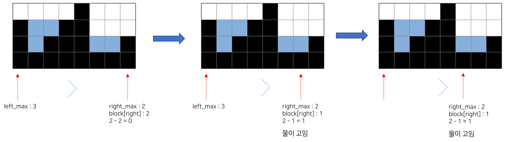

# [백준] 14719번 빗물 파이썬

## 문제

2차원 세계에 블록이 쌓여있다. 비가 오면 블록 사이에 빗물이 고인다.


비는 충분히 많이 온다. 고이는 빗물의 총량은 얼마일까?

## 입력

첫 번째 줄에는 2차원 세계의 세로 길이 H과 2차원 세계의 가로 길이 W가 주어진다. (1 ≤ H, W ≤ 500)

두 번째 줄에는 블록이 쌓인 높이를 의미하는 0이상 H이하의 정수가 2차원 세계의 맨 왼쪽 위치부터 차례대로 W개 주어진다.

따라서 블록 내부의 빈 공간이 생길 수 없다. 또 2차원 세계의 바닥은 항상 막혀있다고 가정하여도 좋다.

## 출력

2차원 세계에서는 한 칸의 용량은 1이다. 고이는 빗물의 총량을 출력하여라.

빗물이 전혀 고이지 않을 경우 0을 출력하여라.

## 예제 입력 1 

```
4 4
3 0 1 4
```

## 예제 출력 1

```
5
```

## 예제 입력 2 

```
4 8
3 1 2 3 4 1 1 2
```

## 예제 출력 2

```
5
```

## 예제 입력 3

```
3 5
0 0 0 2 0
```

## 예제 출력 3

```
0
```

## 제출답안

```python
import sys

input = sys.stdin.readline


def soultion():
    n, m = list(map(int, input().split()))
    block = list(map(int, input().split()))
    left, right = 0 , m - 1
    answer = 0
    left_max = block[left]
    right_max = block[right]
    while left < right :
        left_max = max(left_max, block[left])
        right_max = max(right_max, block[right])
        if left_max >= right_max:
            answer += right_max - block[right]
            right -= 1

        if left_max < right_max:
            answer += left_max - block[left]
            left +=1
    print(answer)

soultion()
```

1. 가로, 세로와 빗물 블럭을 받는다.
2. 투포인터로 진행할 예정이기에 left, right, left_max, right_max를 설정한다.
3. while을 돌면서 left가 right보다 작을 때까지만 진행한다.
   1. 매번 왼쪽과 오른쪽의 max을 찾아서 다시 담는다.
   2. left_max가 right_max보다 크거나 같으면 answer에 지금 right_max와 right로 설정된 인덱스의 블럭 값을 빼서 담는다.
      1. 그리고right에서 1을 뺀다.
   3. left_max가 right_max보다 작다면 answer에 지금 left_max와 left로 설정된 인덱스의 블럭 값을 빼서 담는다.
      1. 그리고 left에 1을 더한다.
4. 이런식으로 돌면 left가 right를 넘게 되고 그 때 끝낸다.
5. answer를 출력한다.



- 위의 과정처럼 왼쪽과 오른쪽을 비교해보고 해당 되는 곳의 max값과 블럭의 값을 비교하여 물이 고이면 answer에 담는 식으로 진행된다.