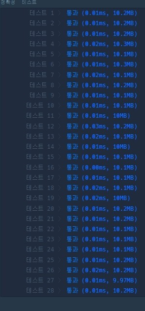
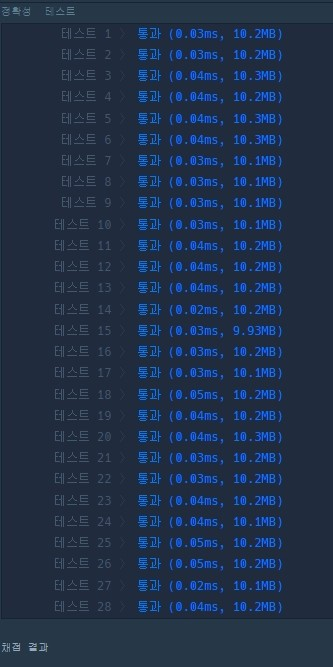

# [프로그래머스] 위장 파이썬

> ### 문제 설명

스파이들은 매일 다른 옷을 조합하여 입어 자신을 위장합니다.

예를 들어 스파이가 가진 옷이 아래와 같고 오늘 스파이가 동그란 안경, 긴 코트, 파란색 티셔츠를 입었다면 다음날은 청바지를 추가로 입거나 동그란 안경 대신 검정 선글라스를 착용하거나 해야 합니다.

| 종류 | 이름                       |
| ---- | -------------------------- |
| 얼굴 | 동그란 안경, 검정 선글라스 |
| 상의 | 파란색 티셔츠              |
| 하의 | 청바지                     |
| 겉옷 | 긴 코트                    |

스파이가 가진 의상들이 담긴 2차원 배열 clothes가 주어질 때 서로 다른 옷의 조합의 수를 return 하도록 solution 함수를 작성해주세요.

> ### 제한사항

- clothes의 각 행은 [의상의 이름, 의상의 종류]로 이루어져 있습니다.
- 스파이가 가진 의상의 수는 1개 이상 30개 이하입니다.
- 같은 이름을 가진 의상은 존재하지 않습니다.
- clothes의 모든 원소는 문자열로 이루어져 있습니다.
- 모든 문자열의 길이는 1 이상 20 이하인 자연수이고 알파벳 소문자 또는 '_' 로만 이루어져 있습니다.
- 스파이는 하루에 최소 한 개의 의상은 입습니다.

> ### 입출력 예

| clothes                                                      | return |
| ------------------------------------------------------------ | ------ |
| [["yellowhat", "headgear"], ["bluesunglasses", "eyewear"], ["green_turban", "headgear"]] | 5      |
| [["crowmask", "face"], ["bluesunglasses", "face"], ["smoky_makeup", "face"]] | 3      |

> ### 입출력 예 설명

예제 #1
headgear에 해당하는 의상이 yellow_hat, green_turban이고 eyewear에 해당하는 의상이 blue_sunglasses이므로 아래와 같이 5개의 조합이 가능합니다.

```
1. yellow_hat
2. blue_sunglasses
3. green_turban
4. yellow_hat + blue_sunglasses
5. green_turban + blue_sunglasses
```

예제 #2
face에 해당하는 의상이 crow_mask, blue_sunglasses, smoky_makeup이므로 아래와 같이 3개의 조합이 가능합니다.

```
1. crow_mask
2. blue_sunglasses
3. smoky_makeup
```

> ### 제출답안

### 1. dict로 계산

1. 옷의 종류를 key로 value는 옷의 이름을 리스트로 만들어서 저장한다.
2. 옷을 입을 수 있는 경우는 다음과 같다.
   1. headgear
      1. yellowhat를 입는 경우
      2. green_turban를 입는 경우
      3. 아무것도 입지 않는 경우
   2. eyewear
      1. bluesunglasses를 쓰는 경우
      2. 아무것도 쓰지 않는 경우
   3. 3*2를 하면 모든 경우의 수가 된다.
   4. 그래서 value(리스트)의 길이에서 아무것도 입지 않는 경우(1)을 더해서 곱하는 것이다.
3. 최소 1가지는 입어야 하기 때문에 모두 입지 않은 경우 1을 빼면 된다.

```python
def solution(clothes):
    answer = 1
    clot_dict = {}
    # (1)
    for i in clothes:
        temp_list = clot_dict.get(i[1], [])
        clot_dict[i[1]] = [*temp_list, i[0]]
	# (2)
    for value in clot_dict.values():
        answer *= len(value) + 1
    return answer - 1
```



### 2. counter로 계산

1. Counter로 옷의 종류에 몇개의 옷이 있는지 확인하기
   1. `Counter({'headgear': 2, 'eyewear': 1})`
2. 옷의 종류 개수에 +1을 하여 `answer`에 곱하기

```python
from collections import Counter

def solution(clothes):
    answer = 1
    # (1)
    clot_dict = Counter([kind for name, kind in clothes])
    
    # (2)
    for value in clot_dict.values():
        answer *= value + 1
    return answer - 1
```



- 여기서는 1번 방법이 시간, 메모리 측면에서 더 효율적이다.