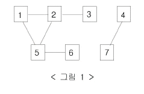

# 백준 2606 바이러스 파이썬

### 문제

신종 바이러스인 웜 바이러스는 네트워크를 통해 전파된다. 한 컴퓨터가 웜 바이러스에 걸리면 그 컴퓨터와 네트워크 상에서 연결되어 있는 모든 컴퓨터는 웜 바이러스에 걸리게 된다.

예를 들어 7대의 컴퓨터가 <그림 1>과 같이 네트워크 상에서 연결되어 있다고 하자. 1번 컴퓨터가 웜 바이러스에 걸리면 웜 바이러스는 2번과 5번 컴퓨터를 거쳐 3번과 6번 컴퓨터까지 전파되어 2, 3, 5, 6 네 대의 컴퓨터는 웜 바이러스에 걸리게 된다. 하지만 4번과 7번 컴퓨터는 1번 컴퓨터와 네트워크상에서 연결되어 있지 않기 때문에 영향을 받지 않는다.



어느 날 1번 컴퓨터가 웜 바이러스에 걸렸다. 컴퓨터의 수와 네트워크 상에서 서로 연결되어 있는 정보가 주어질 때, 1번 컴퓨터를 통해 웜 바이러스에 걸리게 되는 컴퓨터의 수를 출력하는 프로그램을 작성하시오.

### 입력

첫째 줄에는 컴퓨터의 수가 주어진다. 컴퓨터의 수는 100 이하이고 각 컴퓨터에는 1번 부터 차례대로 번호가 매겨진다. 둘째 줄에는 네트워크 상에서 직접 연결되어 있는 컴퓨터 쌍의 수가 주어진다. 이어서 그 수만큼 한 줄에 한 쌍씩 네트워크 상에서 직접 연결되어 있는 컴퓨터의 번호 쌍이 주어진다.

### 출력

1번 컴퓨터가 웜 바이러스에 걸렸을 때, 1번 컴퓨터를 통해 웜 바이러스에 걸리게 되는 컴퓨터의 수를 첫째 줄에 출력한다.

### 예제 입력 1

```python
7
6
1 2
2 3
1 5
5 2
5 6
4 7
```

### 예제 출력 1

```python
4
```

### 답안

```python
import sys
input = sys.stdin.readline
from collections import deque

def bfs(graph, start, visited):
    queue = deque([(start)])
    visited[start] = True
    while queue:
        v = queue.popleft()
        for i in graph[v]:
            if not visited[i]:
                cnt.append(i)
                queue.append(i)
                visited[i] = True

n = int(input())
m = int(input())

graph = [[] for _ in range(n+1)]
cnt = []
for i in range(m):
    a,b = map(int, input().split())
    graph[a].append(b)
    graph[b].append(a)

visited = [False] * (n+1)
bfs(graph, 1, visited)
print(len(cnt))
```

1. 그래프를 만들어서 서로 값이 저장되게 만든다.
2. 그 그래프로 bfs를 실행한다.
   1. 1부터 시작해서 1에 들어가 있는 숫자들의 인덱스에 방문해서 해당 인덱스의 값안에 있는 번호 모두를 다시 또 돌면 된다.

