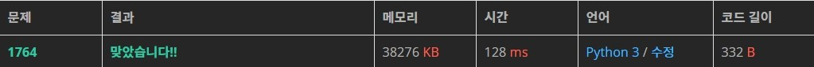

# 백준 1764번 듣보잡 파이썬

### 문제

김진영이 듣도 못한 사람의 명단과, 보도 못한 사람의 명단이 주어질 때, 듣도 보도 못한 사람의 명단을 구하는 프로그램을 작성하시오.

### 입력

첫째 줄에 듣도 못한 사람의 수 N, 보도 못한 사람의 수 M이 주어진다. 이어서 둘째 줄부터 N개의 줄에 걸쳐 듣도 못한 사람의 이름과, N+2째 줄부터 보도 못한 사람의 이름이 순서대로 주어진다. 이름은 띄어쓰기 없이 영어 소문자로만 이루어지며, 그 길이는 20 이하이다. N, M은 500,000 이하의 자연수이다.

듣도 못한 사람의 명단에는 중복되는 이름이 없으며, 보도 못한 사람의 명단도 마찬가지이다.

### 출력

듣보잡의 수와 그 명단을 사전순으로 출력한다.

### 예제 입력

```
3 4
ohhenrie
charlie
baesangwook
obama
baesangwook
ohhenrie
clinton
```

### 예제 출력

```
2
baesangwook
ohhenrie
```

### 제출 답안

```python
import sys
input = sys.stdin.readline

n,m = map(int, input().split())
not_hear = sorted([ input().strip() for i in [n,m] for _ in range(i)])
not_not = []
i = 0
while i<n+m-1:
    if not_hear[i] == not_hear[i+1]:
        not_not.append(not_hear[i])
        i+=2
    else:
        i+=1

print(len(not_not))
print('\n'.join(not_not))
```

1. n,m을 받는다.
2. 단어를 리스트로 만들어서 정렬하는 것을 한 번에 수행한다.
   1. n과 m번 수행해야 하니 리스트로 묶어서 이중for문으로 처음에는 듣도 못한 사람, 두번째는 보도 못한 사람이 리스트에 담긴다
3. 그 다음에 while문으로 앞에와 뒤를 확인하면서 서로 같으면 인덱스 2를 건너뛰고 아니면 1을 더해서 다음거를 확인한다.
4. 걸러진 리스트의 길이와 join으로 문자열을 출력한다.

