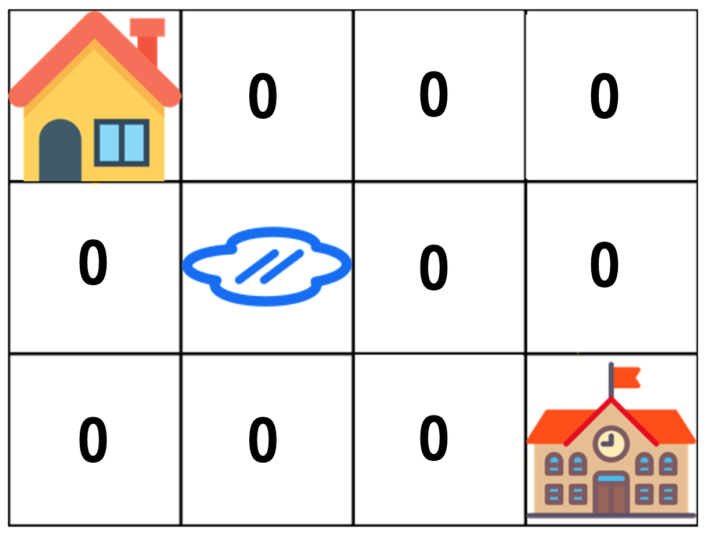

# [프로그래머스] 동적계획법 등굣길 파이썬

###### 문제 설명

계속되는 폭우로 일부 지역이 물에 잠겼습니다. 물에 잠기지 않은 지역을 통해 학교를 가려고 합니다. 집에서 학교까지 가는 길은 m x n 크기의 격자모양으로 나타낼 수 있습니다.

아래 그림은 m = 4, n = 3 인 경우입니다.


가장 왼쪽 위, 즉 집이 있는 곳의 좌표는 (1, 1)로 나타내고 가장 오른쪽 아래, 즉 학교가 있는 곳의 좌표는 (m, n)으로 나타냅니다.

격자의 크기 m, n과 물이 잠긴 지역의 좌표를 담은 2차원 배열 puddles이 매개변수로 주어집니다. **오른쪽과 아래쪽으로만 움직여** 집에서 학교까지 갈 수 있는 최단경로의 개수를 1,000,000,007로 나눈 나머지를 return 하도록 solution 함수를 작성해주세요.

##### 제한사항

- 격자의 크기 m, n은 1 이상 100 이하인 자연수입니다.
  - m과 n이 모두 1인 경우는 입력으로 주어지지 않습니다.
- 물에 잠긴 지역은 0개 이상 10개 이하입니다.
- 집과 학교가 물에 잠긴 경우는 입력으로 주어지지 않습니다.

##### 입출력 예

| m    | n    | puddles  | return |
| ---- | ---- | -------- | ------ |
| 4    | 3    | [[2, 2]] | 4      |

##### 입출력 예 설명


## 문제풀이

- 이번 문제는 고민하다가 도저히 답을 찾을 수 없어서 구글링 하였다.

참고블로그 : https://dev-note-97.tistory.com/141

- 블로그 해설을 보고나서 이해 했다. 
- 내가 이해한 내용을 토대로 다시 구성해보았다.

#### 1단계 - 모두 0으로 초기화하기



#### 2단계 - 집의 위치(시작위치) 1로 설정하기


#### 3단계 - n과 m 으로 for loop  돌기

- 첫 번째
  - 첫 번재 줄은 위쪽에 값이 없으니 왼쪽에 있는 값만 더해서 현재 칸의 값을 업데이트 하며 된다.


- 두 번째
  - 두번째 줄은 위쪽이 있어서 위쪽도 고려해야 한다.
  - 물 웅덩이는 더하면 안되기 때문에 0으로 처리한다.


- 세 번째
  - 마지막 줄도 왼쪽과 오른쪽 칸의 합산으로 업데이트 한다.


## 참고답안

```python
def solution(m, n, puddles):
    puddles = [[q,p] for [p,q] in puddles]      # 미리 puddles 좌표 거꾸로 설정
    dp = [[0] * (m + 1) for i in range(n + 1)]  # dp 초기화하기
    dp[1][1] = 1 # 집의 위치 1로 (시작위치)

    for i in range(1, n + 1):
        for j in range(1, m + 1):
            if i == 1 and j == 1: continue 
            if [i, j] in puddles:    # 웅덩이 위치의 경우 값을 0으로 만들기
                dp[i][j] = 0
            else:                    # 현재 칸은 왼쪽 칸, 위 칸의 합산
                dp[i][j] = (dp[i - 1][j] + dp[i][j - 1]) % 1000000007
    return dp[n][m]
```

