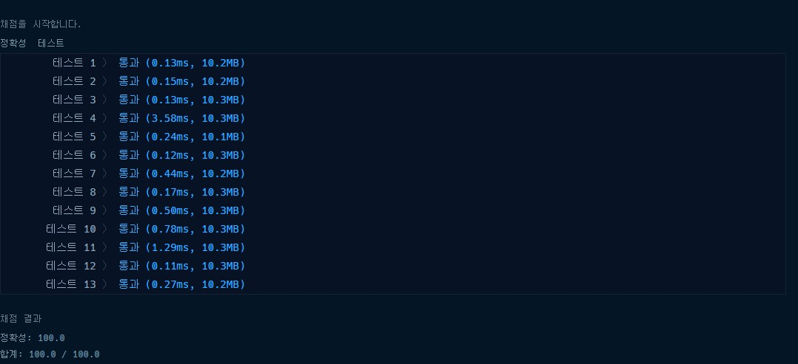

# 프로그래머스 2018 카카오 블라인드 [1차] 뉴스 클러스터링

### [문제링크](https://programmers.co.kr/learn/courses/30/lessons/17677)

### 제출답안

```python
import re

def solution(str1, str2):
    str1_2, str2_2 = {},{}
    for name in zip([str1, str2],[str1_2, str2_2]):
        for i in range(len(name[0]) - 1):
            if len(re.findall(r'[A-Z]', name[0][i:i + 2].upper())) == 2:
                name[1][name[0][i:i + 2].upper()] = name[1].get(name[0][i:i + 2].upper(),0) +1
    uni = 0
    for idx in str1_2:
        if idx in str2_2:
            uni += min(str1_2[idx],str2_2[idx])

    answer = sum(str1_2.values()) + sum(str2_2.values()) - uni
    if answer == 0:
        return 65536
    return int(65536 * uni / answer)
```

1. 우선 문자를 정규식으로 영어 인것만 추려서 딕셔너리에 담는다. 해당 딕셔너리 키 값이 있으면 +1을 하고 아니면 0으로 세팅한다.
2. 그리고 딕셔너리를 돌면서 키값이 다른 딕셔너리에 있으명 그 키값중 작은 값을 계속 저장한다.
3. 모든 값을 더해서 나눈다.

