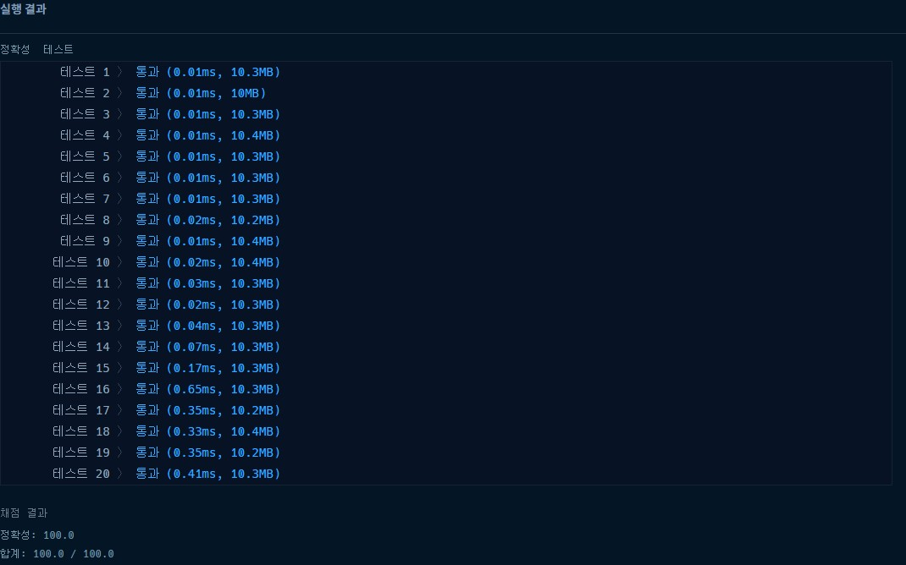

# 프로그래머스 2020 카카오 인턴십 키패드 누르기 파이썬

### [문제링크](https://programmers.co.kr/learn/courses/30/lessons/67256)

### 제출 답안

```python
def solution(numbers, hand):
    right_dict = {2:{2:0,3:1,5:1,6:2,8:2,9:3,'#':4,0:3},5:{2:1,3:2,5:0,6:1,8:1,9:2,'#':3,0:2},8:{2:2,3:3,5:1,6:2,8:0,9:1,'#':2,0:1},0:{2:3,3:4,5:2,6:3,8:1,9:2,'#':1,0:0}}
    left_dict =  {2:{1:1,2:0,4:2,5:1,7:3,8:2,'*':4,0:3},5:{1:2,2:1,4:1,5:0,7:2,8:1,'*':3,0:2},8:{1:3,2:2,4:2,5:1,7:1,8:0,'*':2,0:1},0:{1:4,2:3,4:3,5:2,7:2,8:1,'*':1,0:0}}
    answer = ''
    left = '*'
    right = '#'
    for num in numbers:
        if num in [1,4,7]:
            answer += 'L'
            left = num
        elif num in [3,6,9]:
            answer += 'R'
            right = num
        elif num in [2,5,8,0]:
            rightnum, leftnum = right_dict[num][right], left_dict[num][left]
            if rightnum < leftnum:
                answer += 'R'
                right = num
            elif leftnum < rightnum:
                answer +='L'
                left = num
            elif rightnum == leftnum:
                answer += hand[0].upper()
                if hand[0].upper() == 'R':
                    right = num
                else:
                    left = num
    print(answer)
    return answer
a = [1, 3, 4, 5, 8, 2, 1, 4, 5, 9, 5]
solution(a, 'right')
```

1. 우선 2,5,8,0에 해당되는 오른쪽 왼쪽 길이를 딕셔너리로 만들어서 각 길이를 저장하였다.
2. 맨 처음에 left와 right를 초기화하고 진행한다.
3. 왼쪽에 해당되는 숫자랑 오른쪽에 해당되는 숫자인경우에 answer에 각각 해당되는 문자를 더하고 left와 right를 현재 들어온 숫자로 다시 바꾼다.
4. 2,5,8,0이면 이번에 해당되는 숫자에서 지금까지 저장된 left와 right의 길이를 비교하고 작은쪽을 answer에 더하고 같으면 hand의 첫글자만 대문자로 바꿔서 더하고 이 대문자를 비교해서 오른쪽과 왼쪽의 값을 다시 초기화한다.
5. 그리고 출력하면 끝!
6. 문제의 의도는 bfs같았지만.....그냥 딕셔너리로 하는게 문제  푸는 시간을 줄일것 같았다. bfs는 어떻게 구성해야할지 감도 안왔당...

