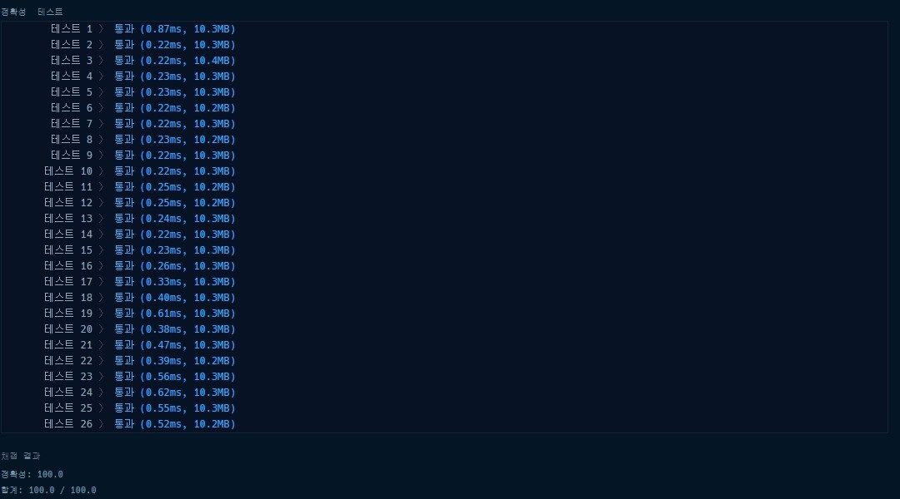

# 프로그래머스 2021 카카오 블라인드 신규 아이디 추천 파이썬

### [문제링크](https://programmers.co.kr/learn/courses/30/lessons/72410)

### 제출답안

```python
import re
def solution(new_id):
    new_id = ''.join([ i.lower() for i in list(new_id)])
    new_id = ''.join(re.findall(r'[0-9 | a-z | \- | \_ | \.]',new_id))
    new_id = re.sub('[..]+' ,'.',new_id)
    if new_id[0] == '.':  
    	if len(new_id) > 1:
    		new_id = new_id[1:]
    	else:
    		new_id = 'a'
    if new_id[-1] == '.': 
    	if len(new_id) > 1:
    		new_id = new_id[:-1]
    	else:
    		new_id = 'a'
    if len(new_id) > 15:
    	new_id = new_id[:15]
    	if new_id[-1] == '.':new_id=new_id[:-1]
    if len(new_id) < 3:
    	new_id = new_id.ljust(3,new_id[-1])
    print(new_id)
    answer = new_id
    return answer
```

1. 정규식을 쓸거기에 re를 import한다.
2. 우선 문자를 다 소문자로 바꾼다.
3. 거기서 findall로 해당되는 조건들만 다시 저장한다.
4. ..이 2개이상이면 .으로 바꾼다.
5. 처음이 .으로 시작하고 리스트 개수가 2개이상이면 `1:`로 저장하고 아니면 a로 바꾼다.
6. 끝자리가 .이면서 2개이상이면 `:-1`까지 저장하고 아니면 a를 저장한다.
7. 15자리수가 넘으면 15까지 끊는다.
8. 3이하이면 마지막 자리수를 ljust를 사용하여 3까지 반복한다.

