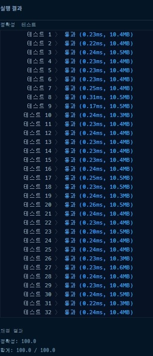

# 프로그래머스 [1차] 다트 게임 파이썬

[문제링크](https://programmers.co.kr/learn/courses/30/lessons/17682)

### 제출 답안

```python
import re

def solution(dartResult):
    dartResult = [i for i in re.split(r'([0-9]+)|(#)|(\*)', dartResult) if i not in ['',None]]
    score = []
    score2 = []
    print(dartResult)
    for i,val in enumerate(dartResult):
        if val in ['D', 'S', 'T']:
            if val == 'D':
                score.append(int(dartResult[i - 1]) ** 2)
            elif val == 'S':
                score.append(int(dartResult[i - 1]) ** 1)
            else:
                score.append(int(dartResult[i - 1]) ** 3)
        elif val in ['#', '*']:
            score.append(dartResult[i])
        else:
            continue
    print(score)        
    for idx, value in enumerate(score):
        print(score2)
        if value == '*' and idx > 1:
            score2[-2] = score2[-2] * 2
            score2[-1] = score2[-1] * 2
        elif value == '*' and idx == 1:
            score2[-1] = score[idx - 1] * 2
        elif value == '#':
            score2[-1] = (score[idx - 1] * -1)
        else:
            score2.append(score[idx])
    print(score2)
    answer = sum(score2)
    return answer


a = '1S2D*3T'
solution(a)

>
print(dartResult)
> ['1', 'S', '2', 'D', '*', '3', 'T']

print(score)
> [1, 4, '*', 27]

print(score2)
> 
[]
[1]
[1, 4]
[2, 8]

print(score2)
> [2, 8, 27]
```

- 저번에 풀었던 파일정렬과 마찬가지로 정규식을 사용하여 문자를 나누었다. 이번에는 숫자뿐만아니라 #,*도 추가하여 스플릿하였다. 처음 나누면 공백과 None값이 들어있어서 이 값은 리스트로 담지 않았다.

1. 다시 만든 리스트로 for문을 돌려서 값이 D,S,T 중에 하나라면 이 이전값에 해당되는 제곱을 수행한다.
   1. 그 다음에 이 값을 리스트에 저장한다.
2. 만약에 #,* 중에 하나면 그냥 그대로 리스트에 저장하고 숫자면 넘어간다.
3. 위에서 만들어진 리스트를 다시 for문을 돌린다.
4. 그러면 연산된 값과 #,*으로 돌려지며 만약에 옵션값이 들어있으면 해당 연산을 수행한다.
   1. *면서 인덱스가 1이상인것은 앞에 2개의 값이 있다는 뜻으로 score2의 -2와 -1의 값을 대체한다.
   2. -2는 2번째 전에 만들어진것으로 연산이 수행되었거나 날것값일수도 있다.
   3. -1은 옵션이 가지는 값이다. 즉, 1*이면 1인값이 들어있는것이다. 그 이유는 숫자면 그냥 append시켰기때문에 -1이 옵션의 값이다.
   4. 그리고 *면서 인덱스가 1인것은 처음에 *가 나온것으로 그냥 그 값에 2를 곱한다/
   5. #이면 -1을 곱한다.
   6. 숫자면 그냥 리스트에 저장한다.
5. 이렇게 해서 최종으로 sum을하면 된다.

