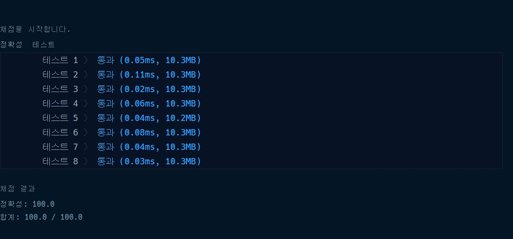

# 프로그래머스 [1차] 비밀지도 파이썬

[문제링크](https://programmers.co.kr/learn/courses/30/lessons/17681)

```python
def solution(n, arr1, arr2):
    answer = [[] for _ in range(n)]
    as2 = []
    for idx, value in enumerate(zip(arr1,arr2)):
        arr1[idx] = format(value[0],'b').zfill(n)
        arr2[idx] = format(value[1], 'b').zfill(n)
    for idx2,value2 in enumerate(zip(arr1,arr2)):
        for idx3,value3 in enumerate(zip(value2[0],value2[1])):
            if value3[0] == '0' and value3[1] == '0':
                answer[idx2].append(' ')
            else:
                answer[idx2].append('#')
    for i in answer:
        as2.extend(''.join(i))
    res = []
    for ii in range(0,len(as2),n):
        res.append(''.join(as2[ii:ii+n]))
    return res
```

1. 우선 정수를 이진수로 바꿔서 정답을 담을 리스트를 만든다.
2. 그 다음에 arr1과 arr2를 zip으로 받아서 이진수로 바꾸고 'b'는 없애고 zfill로 0을 b만큼 채운다.

```
arr1 ['101110', '100001', '100001', '010110', '011111', '110010']
arr2 ['011011', '111000', '010011', '001110', '001110', '001010']
```

1. 바뀐 arr1과 arr2를 다시 for문으로 돌려서 '01001'과 '11110'을 받아온다.
   1. 이렇게 받아온 값을 다시 zip으로 묶어서 앞에서 하나씩 for문을 돌려 둘다 0이면 공백을 아니면 #을 맨 처음에 만든 리스트에 append한다.

```
answer [['#', '#', '#', '#', '#', '#'], ['#', '#', '#', ' ', ' ', '#'], ['#', '#', ' ', ' ', '#', '#'], [' ', '#', '#', '#', '#', ' '], [' ', '#', '#', '#', '#', '#'], ['#', '#', '#', ' ', '#', ' ']]
```

1. 그걸 join으로 공백을 지워서 다시저장한다.

```
as2 ['#', '#', '#', '#', '#', '#', '#', '#', '#', ' ', ' ', '#', '#', '#', ' ', ' ', '#', '#', ' ', '#', '#', '#', '#', ' ', ' ', '#', '#', '#', '#', '#', '#', '#', '#', ' ', '#', ' ']
```

1. 최종적으로 n만큼 띄워서 공백을 지워서 다시 저장하면 정답이 나온다.

```
res ['######', '###  #', '##  ##', ' #### ', ' #####', '### # ']
```

