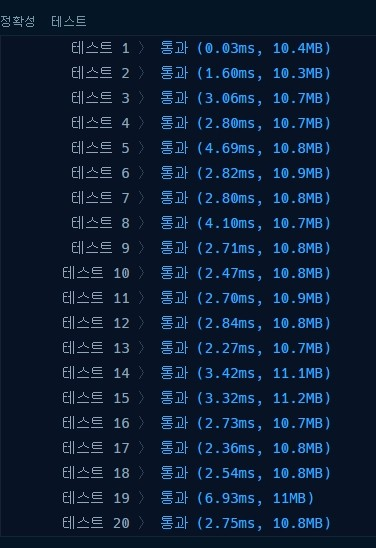

# 프로그래머스 [3차] 파일명 정렬 파이썬

[문제링크](https://programmers.co.kr/learn/courses/30/lessons/17686)

```python
import re
def solution(files):
    file2 = [ re.split(r'([0-9]+)', i) + [idx] for idx,i in enumerate(files)]
    answer = [''.join(i[0:-1]) for i in sorted(file2, key=lambda x:(x[0].lower(),int(x[1]),x[-1]))]
    print(answer)
    return answer
solution(['img12.png', 'img10.png', 'img02.png', 'img1.png', 'IMG01.GIF', 'img02.png', 'img2.JPG', 'img10.png', 'img12.png'])
```

1. 정규식을 활용하여 숫자로 분리한다.
   1. [0-9], ([0-9]),([0-9]+),[0-9]+의 차이점이 무엇인지 보자. 우선 괄호를 넣으면 분리되는 숫자까지 넣어서 리스트로 만들어 진다.
2. 그 다음에 인덱스순으로 정렬해야하기때문에 인덱스도 같이 넣어준다.
3. 람다식으로 해더, 중간, 인덱스 순으로 정렬해서 join으로 리스트를 만들면 끝난다.



#### r'([0-9]+)'

```python
[['img', '12', '.png', 0], ['img', '10', '.png', 1], ['img', '02', '.png', 2], ['img', '1', '.png', 3], ['IMG', '01', '.GIF', 4], ['img', '02', '.png', 5], ['img', '2', '.JPG', 6], ['img', '10', '.png', 7], ['img', '12', '.png', 8]]
```

- 같은 숫자끼리는 붙이고, 숫자를 포함하여 리스트를 만들어준다. +는 반복을 의미한다.

#### r'([0-9])'

```python
[['img', '1', '', '2', '.png', 0], ['img', '1', '', '0', '.png', 1], ['img', '0', '', '2', '.png', 2], ['img', '1', '.png', 3], ['IMG', '0', '', '1', '.GIF', 4], ['img', '0', '', '2', '.png', 5], ['img', '2', '.JPG', 6], ['img', '1', '', '0', '.png', 7], ['img', '1', '', '2', '.png', 8]]
```

- 숫자끼리 떨어트리고 숫자를 포함하여 리스트 생성

#### r'[0-9]+'

```python
file4 [['img', '.png', 0], ['img', '.png', 1], ['img', '.png', 2], ['img', '.png', 3], ['IMG', '.GIF', 4], ['img', '.png', 5], ['img', '.JPG', 6], ['img', '.png', 7], ['img', '.png', 8]]
```

- 괄호가 없어서 숫자가 포함되지  않았다.

#### r'[0-9]'

```python
file5 [['img', '', '.png', 0], ['img', '', '.png', 1], ['img', '', '.png', 2], ['img', '.png', 3], ['IMG', '', '.GIF', 4], ['img', '', '.png', 5], ['img', '.JPG', 6], ['img', '', '.png', 7], ['img', '', '.png', 8]]
```

