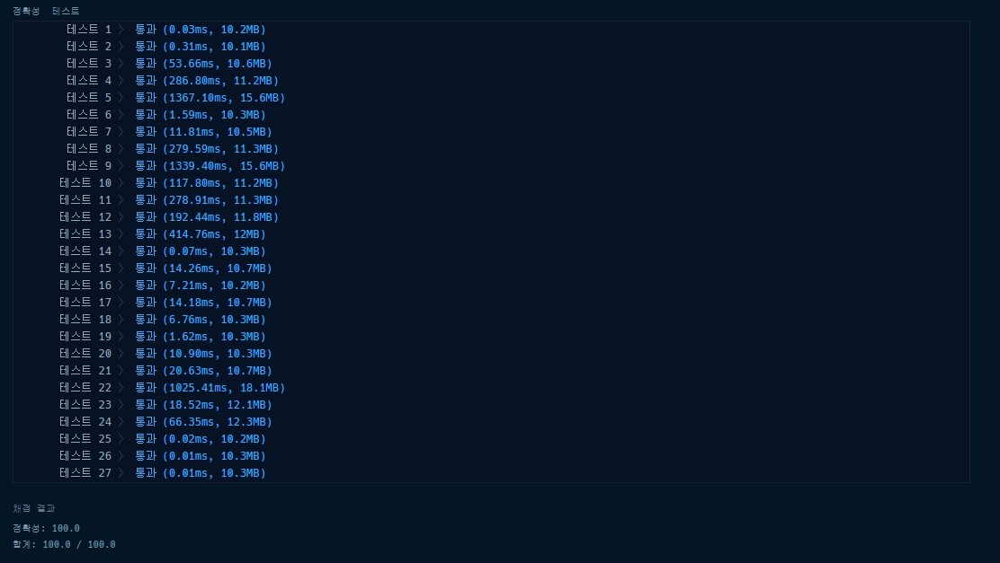

# 프로그래머스 실패율 파이썬

[문제링크](https://programmers.co.kr/learn/courses/30/lessons/42889)

### 문제

실패율은 다음과 같이 정의한다.

- 스테이지에 도달했으나 아직 클리어하지 못한 플레이어의 수 / 스테이지에 도달한 플레이어 수

### 제한 사항

- 스테이지의 개수 N은 `1` 이상 `500` 이하의 자연수이다.
- stages의 길이는 `1` 이상 `200,000` 이하이다.
- stages에는`1` 이상 `N+1` 이하의 자연수가 담겨있다.
  - 각 자연수는 사용자가 현재 도전 중인 스테이지의 번호를 나타낸다.
  - 단, `N + 1` 은 마지막 스테이지(N 번째 스테이지) 까지 클리어 한 사용자를 나타낸다.
- 만약 실패율이 같은 스테이지가 있다면 작은 번호의 스테이지가 먼저 오도록 하면 된다.
- 스테이지에 도달한 유저가 없는 경우 해당 스테이지의 실패율은 `0` 으로 정의한다.

### 입출력 예

| N    | stages                   | result      |
| ---- | ------------------------ | ----------- |
| 5    | [2, 1, 2, 6, 2, 4, 3, 3] | [3,4,2,1,5] |
| 4    | [4,4,4,4,4]              | [4,1,2,3]   |

### 답안

```python
def solution(N, stages):
    stages.sort()
    stages_cnt = []
    m = 0
    if N>=stages[-1]:
    	m = N
    else:
    	m = stages[-1]
    for i in range(m):
    	a = stages.count(i+1)
    	if a != None:
    		stages_cnt.append(a)
    	else:
    		stages_cnt.append(0)
    answer = [[i+1] for i in range(N)]
    for i in range(N):
        try :
            h = stages_cnt[i] / sum(stages_cnt[i:])
            answer[i].append(1-h)
        except ZeroDivisionError:
        	answer[i].append(1)
    answer = [i[0] for i in sorted(answer, key=lambda x:(x[1],x[0]))]
    return answer
```

1. stages를 오름차순으로 정렬한다.
2. 그 다음에 stages에 있는 단계들의 개수를 구하는 리스트를 만든다.
3. m을 따로 설정한 이유는 N이 5여도 stages안에 있는 단계가 5보다 낮을 경우가 있어서 m을 만들었다.
4. 만약에 stages안에 해당 인덱스의 단계가 없다면 0으로 설정한다.
5. 그런후 2중 리스트를 만들어서 해당 리스트로 for문을 돌린다.
6. try, except를 한 이유는 0으로 0을 나누면 에러가 발생하기 때문에 그 경우에 0을 넣기 위해서 하였다.
7. 우리가 구한 스테이지별 개수를 맨 처음부터 구해나간다.
   1. 예를 들어 총 6단계까지 클리어한 유저가 있고 1간계에는 1명이고 뒤에 7명의 유저가 더 있다. 그렇기 때문에 해당 i/[i:] 를 한다. 해당 스테이지부터 뒤에있는 스테이지까지 다 더해서 나눈다.
8. 마지막으로 이중리스트를 람다로 정리하면 된다.

