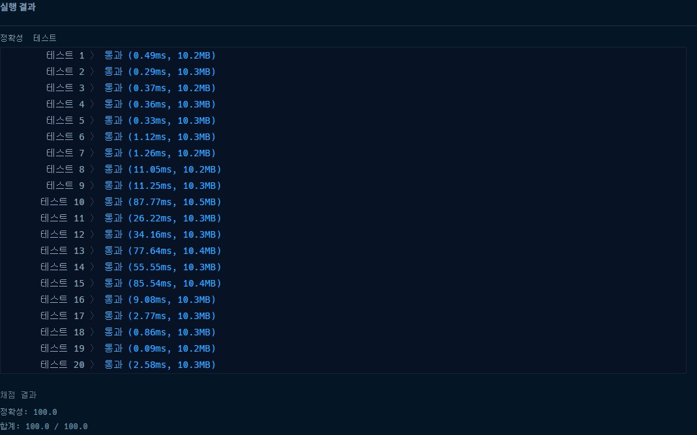

# 프로그래머스 카카오 블라인드 테스트 메뉴 리뉴얼 파이썬

### [문제링크](https://programmers.co.kr/learn/courses/30/lessons/72411)

### 제출답안

```python
from itertools import combinations
import sys
input = sys.stdin.readline

def solution(orders, course):
    answer = {}
    for n in course:
        food = {}
        for i in orders:
            combi = list(combinations(sorted(i), n))
            print(combi)
            for i2 in combi:
                try:food[''.join(i2)] += 1
                except: food[''.join(i2)] = 1
        food = dict(filter(lambda x:x[1] == max(food.values()), food.items()))
        for idx in food.keys():
            answer[idx] = max(food.values())
    answer = dict(filter(lambda x:x[1] >= 2, answer.items()))
    answer = [ i[0] for i in sorted(answer.items(), key=lambda x : (x[0],x[1]),reverse=False)]
    return answer
```

1. 이전에 풀었던 순위검색 문제랑 비슷하게 combination을 활용하여 조합을 구한 뒤 그걸 딕셔너리에 넣어서 같은 값이 있으면 +1을 아니면 그 값을 1로 주어서 담는다.
2. 코스요리 개수중에서 가장 큰 값을 찾아서 그것만 따로 다른 딕셔너리에 넣어서 2번 넘는 값만 필터링 한다.
3. 마지막으로 이름순서대로 정렬한다.



