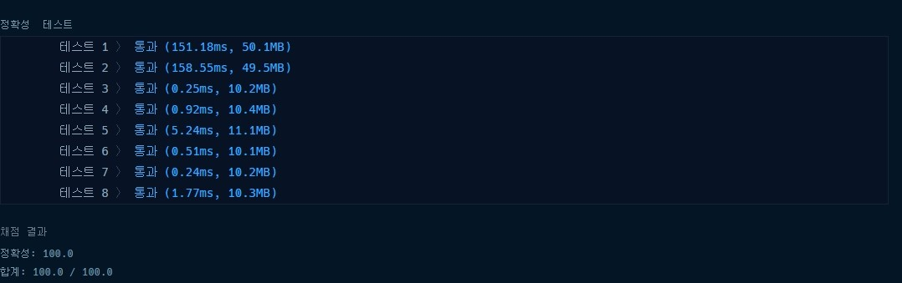

# 프로그래머스 타겟 넘버 파이썬

### [문제링크](https://programmers.co.kr/learn/courses/30/lessons/43165)

### 제출답안

```python
def solution(numbers, target):
    answer = [0]
    for i in numbers:
        sum_mid_list = []
        for j in answer:
            sum_mid_list.append(j+i)
            sum_mid_list.append(j-i)
        answer = sum_mid_list
    
    return answer.count(target)
```

1. 처음값을 0으로 두고 numbers에 있는 값들을 -와 + 모두 해서 더한다.
2. 이 값을 계속해서 +,-하면서 누적한다.
3. 마지막으로 target를 찾는다.

